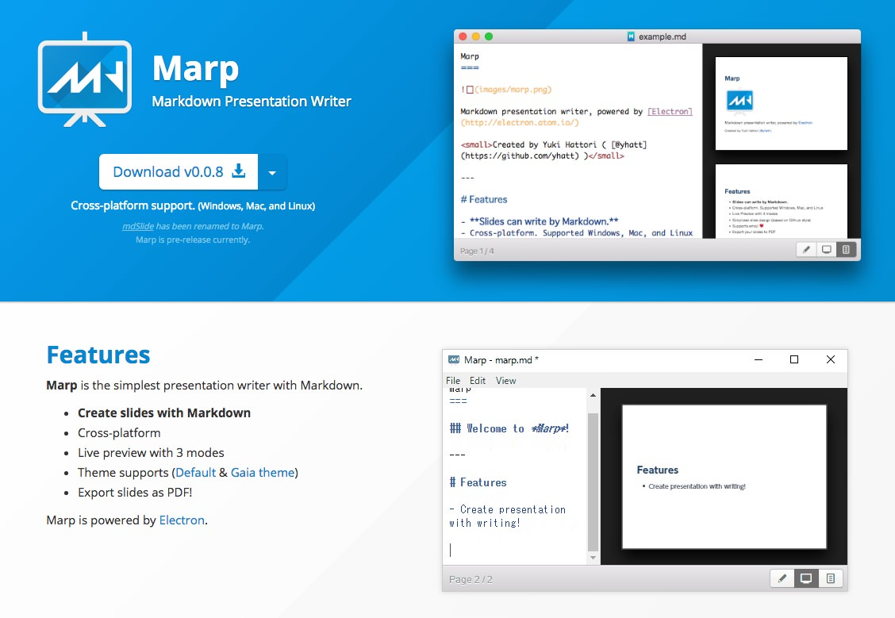

<!-- $theme: gaia -->

# 画面設計ナメんな

#### 2016-09-02

#### DTS Developer's Meetup #12

----
<!-- page_number: true -->

## 自己紹介
- 梅澤 雄一郎 (051613/G3/ITA-s)
- 法人通信事業本部 第二法人事業部
  - 大手テーマパーク向けデータ分析基盤担当
- 業務外
  - Play Framework ドキュメント翻訳 (休憩中...)
  - [JJUGナイトセミナー Javaフレームワーク特集](https://jjug.doorkeeper.jp/events/46954) 登壇
  - その他、勉強会開催/参加、寄稿など

----
## 自己紹介

----
# 画面設計ナメんな

----
# 画面設計とは

だいたいこういうものを作る

- 画面遷移図
- 画面レイアウト定義
- 画面項目定義
- 入出力項目定義
- メッセージ定義
- 処理設計

----
# 画面設計とは

今日のスコープはここ

- <u>画面遷移図</u> :point_left:
- <u>画面レイアウト定義</u> :point_left:
- 画面項目定義
- 入出力項目定義
- メッセージ定義
- 処理設計

----
# 画面遷移図

----
# 画面レイアウト

----
# なにか問題でも？

----
# 画面遷移図

確認画面と完了画面って本当に必要？

----
# 画面レイアウト

色も配置もごちゃごちゃで使いづらそう...

----
# 画面設計あるある
- スカスカのトップページ/メニューページ
- 誰も読まない FAQ ページ
- ボタンの配置やラベルがバラバラ
- ポップアップ、子画面の濫用
- 縦/横に長いスクロール
- とりあえず CSV アップロード/ダウンロード
- etc.

----
# その結果
- 工数増加、品質低下
  - 入力画面と確認画面でコードをコピペ
  - 行きつ戻りつ画面遷移するとバグる
- お客様の不評の声
  - 「システム刷新したら使いにくくなった」
  - 「遅い」
  - 「印刷できない」

----
# 失敗パターン

----
# 失敗パターン
- 画面設計しながら要件定義
  - 本質的ではない仕掛けに凝る
  - 業務要件を突っ込んで定義しない
- 言われたことをそのまま設計
  - 正常系しか考慮しない
  - ユーザは正しく操作すると思い込む

----
# 失敗パターン
- 勉強不足、知識不足
  - 標準的なガイドライン等を知らない/読まない
  - 優れたUIを提供しているサービスを試さない
  - Webでできる/できないことを理解していない
- 認識不足
  - UI/UXはそれだけで食える人がいる分野
  - 画面はお客様とシステムの唯一の接点

----
# 成功 (するかもしれない) パターン

----
# 成功 (するかもしれない) パターン
- 要件定義工程で画面を設計しない
  - お客様から「画面ないと要件定義できない」と言われても乗らない
  - 手書きのペーパープロトタイプに止める
  - 業務要件を引き出す補助ツールとして使う
- 要件 -> UI -> UX の順に定義/設計する
  - UI/UX に凝って要件を漏らさない
  - UI 設計が適切なら UX は自ずと高まるはず

----
# 成功 (するかもしれない) パターン
- 巨人の肩の上に立つ
  - [Webデザインのセオリーを学ぼう](http://www.slideshare.net/shirokuro331/web-11608357)
  - [色彩センスのいらない配色講座](http://www.slideshare.net/marippe/ss-9003317)
  - [CSSフレームワーク30選！デザイン含めて一括総まとめ](http://eng-entrance.com/css-framework)
- モバイルも勉強する
  - [iOS Human Interface Guidelines](https://developer.apple.com/ios/human-interface-guidelines/)
  - [Design \| Android Developers](https://developer.android.com/design/index.html)

---
# 成功 (するかもしれない) パターン
- お客様のことを真剣に考える
  - 日々の業務で一番多く行う操作は？
  - なにを、どこに、どんな順番で並べるべき？
  - もっと簡単に操作できないか？
  - このエラーメッセージは分かり易いか？
  - **「使いやすい」って言ってもらえるか？**

---
# まとめ

---
# 画面設計ナメんな
- 画面 (UI/UX) は要件を実現する手段のひとつ。 目的と手段を混同しない
- 画面を表示する方法は日々進化している。旧来の設計に停滞せず、近代的な設計に挑戦する
- 先人の知恵、公式ガイドライン、フレームワーク等を活用する。無駄なコストを費やさない
- 画面はお客様とシステムの唯一の接点。お客様の日々の業務を真剣に考えて設計する

---
# おまけ

---
# Marp

----
# 次回予告

- <b>テーブル設計ナメんな</b>
- <b>共有ファイルサーバ ｲﾗﾈ!!(*ﾟДﾟ)ノ</b>
- <b>暗号化ファイル添付メール (°言°怒)</b>

----
# おわり