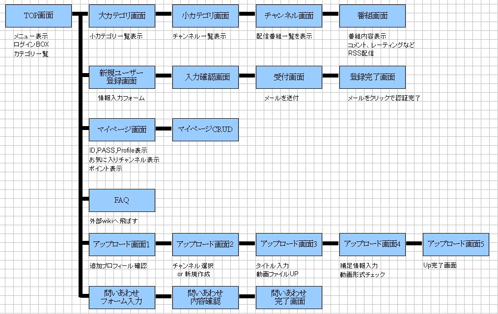
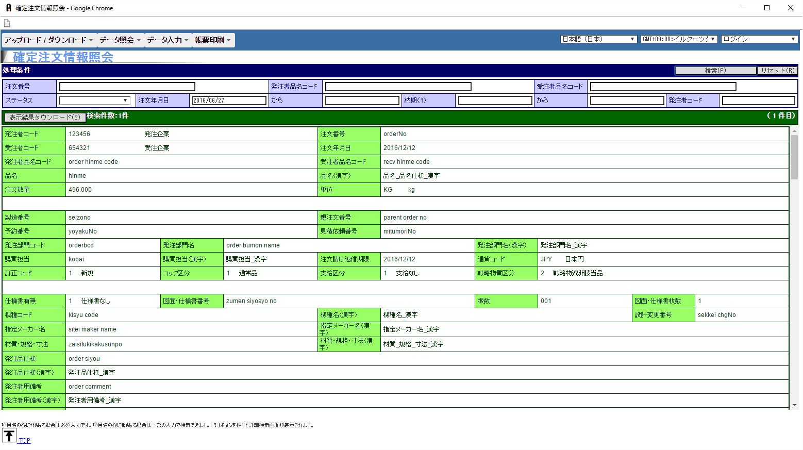
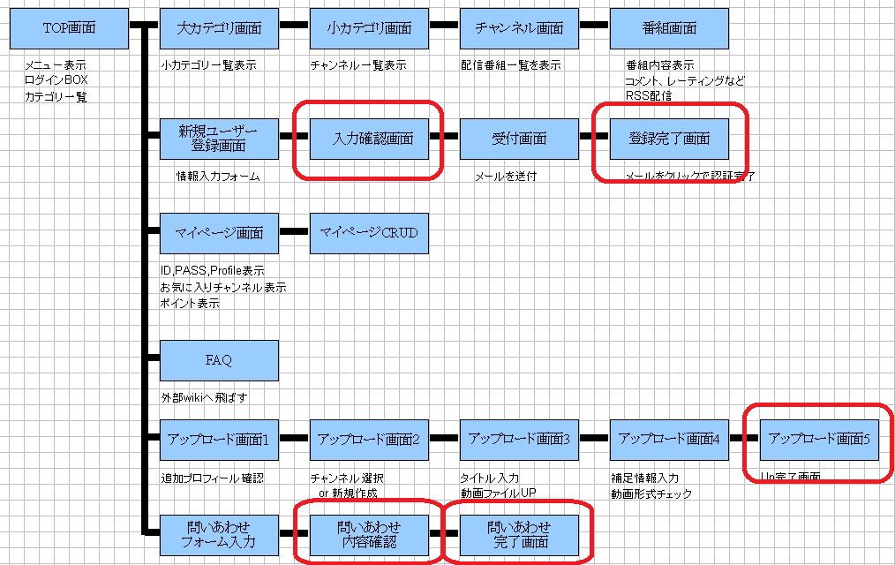

<!-- $theme: gaia -->

# 画面設計ナメんな

##### 2016-09-02

##### DTS Developer's Meetup #12

----
<!-- page_number: true -->

## 自己紹介
- 梅澤 雄一郎
- 法人通信事業本部 第二法人事業部
  - ITA-s
  - 大手テーマパーク向けデータ分析基盤担当
- 業務外
  - Play Framework ドキュメント翻訳 (休憩中...)
  - [JJUGナイトセミナー Javaフレームワーク特集](https://jjug.doorkeeper.jp/events/46954) 登壇
  - 勉強会開催/参加、寄稿など

----
## 自己紹介

----
# 画面設計とは

----
# 画面設計

だいたいこういうものを作る

- 画面遷移図
- 画面レイアウト定義
- 画面項目定義
- 入出力項目定義
- メッセージ定義
- 処理設計

----
# 画面設計

今日のスコープはここ

- <u>画面遷移図</u> :point_left:
- <u>画面レイアウト定義</u> :point_left:
- 画面項目定義
- 入出力項目定義
- メッセージ定義
- 処理設計

----
# 画面遷移図

----
# 画面レイアウト

----
# なにか問題でも？

----
# 画面遷移図

確認画面と完了画面って本当に必要？

----
# 画面レイアウト

色も配置もごちゃごちゃ

----
# その他の画面設計あるある
- スカスカのトップページ/メニューページ
- 誰も読まない FAQ ページ
- 配置や文言の不統一
- ポップアップ、子画面の濫用
- 縦/横に長いスクロール
- 右クリック、戻るボタンの禁止

----
# 結果こうなる
- 工数増加、品質低下
  - 入力画面と確認画面でコードをコピペ
  - 行きつ戻りつ画面遷移するとバグる
- お客様から不評の嵐
  - 「システム刷新したら使いにくくなった」
  - 「遅い」
  - 「印刷できない」

----
# どうしてこうなった

----
# 画面設計失敗要因
- 画面設計しながら要件定義
  - 議論が発散して本質的でない仕掛けに凝る
  - 業務要件を充分に把握できない
- 成果物が目に見え易い
  - 特別な技能がなくても担当できると思い込む
  - 正常系だけに意識が集中する

----
# 画面設計失敗要因
- 勉強不足、知識不足
  - 標準ガイドライン等を知らない、読まない
  - 優れたUIを提供しているサービスを試さない
  - Webでできる/できないことを理解していない
- 認識不足
  - UI/UXはそれだけで食える人がいる分野
  - お客様とシステムの唯一の接点

----
# それじゃあどうする？

----
## 次回予告

- テーブル設計ナメんな
- 共有ファイルサーバ ｲﾗﾈ!!(*ﾟДﾟ)ノ⌒ﾟ
- 暗号化ファイル添付メール (°言°怒)

----
# おわり