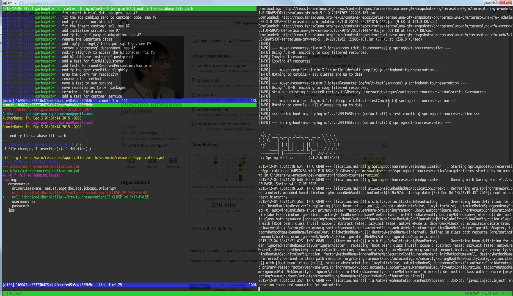

# gnupack を使おう
2015-12-10<br/>
DTS Developer's Meetup #9

---

## 自己紹介
- 梅澤 雄一郎
- 産業公共事業本部産業事業部
  - オムニチャネル案件ビッグデータ担当
- 業務外
  - Play Framework ドキュメント翻訳 (休憩中...)
  - WEB+DB PRESS vol.71 寄稿
  - Developer's Summit 2013 登壇

---

## こんな経験ありませんか

---

## アクセス過多で<br/>システムがダウン寸前

---

## アクセス数の多い<br/> IP アドレスを調べて報告

---

## ありがちな対応
- TeraTerm
  - アクセスログをコピーする
- WinSCP
  - アクセスログをダウンロードする
- さくらエディタ
  - アクセスログを加工する
- Excel
  - アクセスログを集計する

---

## ありがちな問題
- TeraTerm
  - アクセスログのコピーに時間が掛かる
- WinSCP
  - アクセスログのダウンロードに時間が掛かる
- さくらエディタ
  - ファイルサイズが大き過ぎて開けない
- Excel
  - Excel 2003 なので 65,536 行以上を扱えない

---

## 二時間掛かっても終わらない<br/>＼(^o^)／

---

## 一方その頃シェル芸人は
```sh
$ cat access.log \               　　 # アクセスログの中身を
  | awk -F'\t' '{ print $1 }' \ 　 　 # タブで区切って先頭だけ出力
  | sort \                       　　 # 並び替えて
  | uniq -c \                    　　 # 集約して件数を取得して
  | sort -nr \                   　　 # 数値の降順として並び替えて
  | head -10                     　　 # 上位 10 件を表示
```
ワンライナーを書いて二秒で対応した

---

## どうしてこうなった

---

## 黒い画面に対する敷居
- 業務はやっぱりウインドーズ
  - コマンドプロンプトの前世紀感
  - PowerShell の異常な背景色
- Cygwin, coLinux, VirtualBox のイマイチ感
  - 管理者権限が与えられない現場もある
- そもそも黒い画面はなんだか怖い

---

## そこで gnupack ですよ

---

## gnupack とは
- 超絶便利な cygwin (と emacs, gvim)
- 簡単インストール
  - アーカイブファイルを展開するだけ
  - 管理者権限不要
- 32bit/64bit 両対応
- プライベートフォント
- プロセス環境変数

---

## 豊富なパッケージ
- apt-cyg, gcc, make
- gawk, grep, sed
- gzip, tar, unzip, zip
- vim
- subversion, git
- perl, python, ruby

---

## おれの黒い画面

zsh, oh-my-zsh, tmux, tig, java 等を追加

---

## gnupack が解決する問題
- ウインドーズでも黒い画面
  - 管理者権限不要
  - ファイルシステムのシームレスな統合
- (比較的) 美しいフォント
- history がメモ代わり
- git でおれおれバージョン管理

---

## gnupack が解決しない問題
- cygwin の問題
  - 64bit 版の場合、マルチバイトパスの補完が重い?
  - node.js サポート対象外

---

## まとめ
- ~~Mac/Linux を使おう~~
- 仕事で使う道具を選ぼう
- 仕事で使う道具に慣れよう
- 仕事を速く終わらせよう

---

## 参考
- [gnupack Users Guide](http://gnupack.osdn.jp/docs/UsersGuide.html)
- [gnupack(Cygwin) + oh-my-zsh + tmuxの環境を構築する - yuukiar.co](http://yuukiar.co/blog/2015/05/28/setup-zsh-tmux-on-cygwin-gnupack/)

---

# おわり
